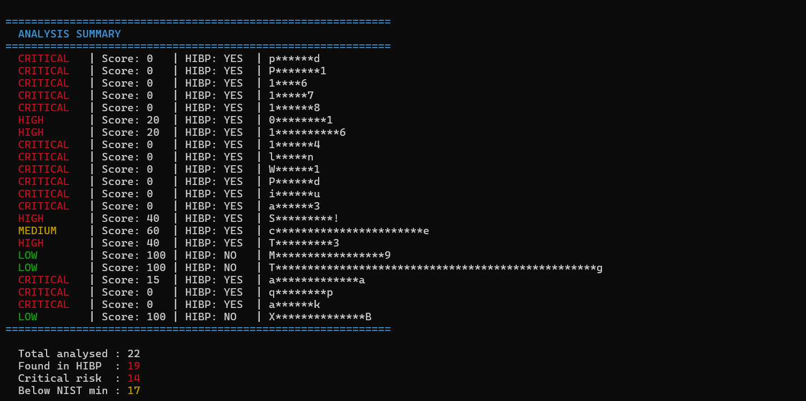
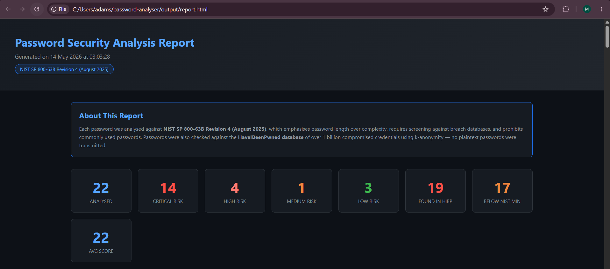
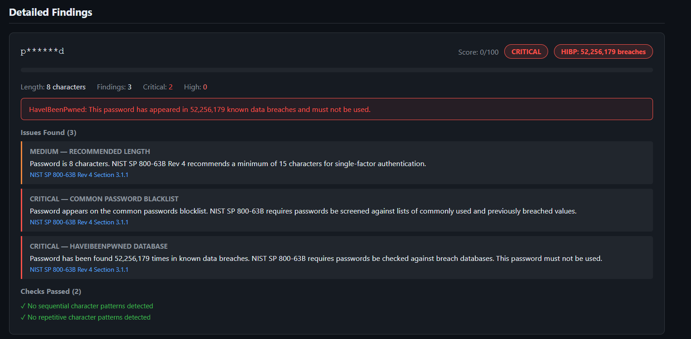
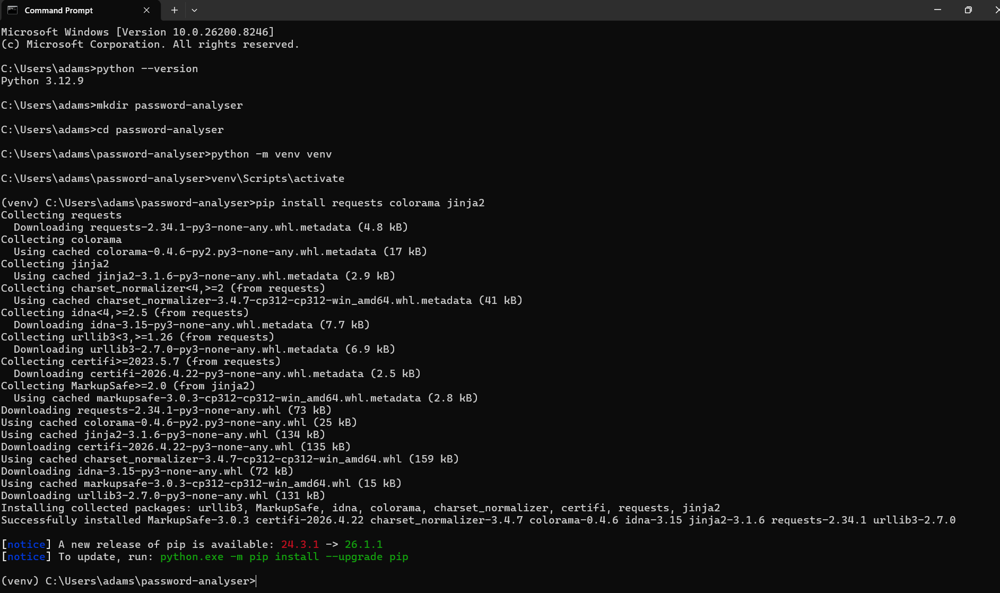

# Python Password Security Analyser

I built this small Python project after finishing my Azure honeypot project. Watching 80,000 real
brute force attacks hit a server and seeing the usernames being tried (admin,
password, 123456) made me want to build something that shows exactly why
those attacks work so often. This tool is the answer to that question.

It takes a list of passwords, runs them through six checks based on the latest
NIST guidelines, hits the HaveIBeenPwned API to see if they appear in real
breach databases, and spits out a professional HTML report with scores and
findings for each one.

---

## Result Summary

22 passwords tested in the included sample run.

- 19 out of 22 found in known breach databases
- 14 rated Critical risk with a score of 0/100
- 17 below the NIST recommended minimum length
- "123456" appeared 209,972,844 times in known breaches
- "password" appeared 52,256,179 times
- Only 3 passwords came back completely clean







---

## The Privacy Detail

Checking a password against a breach database sounds like a privacy problem.
If you send your password to a server to check it, you have just given your
password away. The HaveIBeenPwned API solves this with k-anonymity.

The password is hashed with SHA-1 locally. Only the first 5 characters of
that hash are sent to the API. The API returns every hash in its database
starting with those same 5 characters, typically 500 to 1000 results. The
full comparison happens locally on your machine. The server never saw the
password and never saw enough of the hash to work backwards to it.

This is the same method used by Google Password Checkup and 1Password.

---

## Checks Performed

Each password is scored out of 100 and rated Critical, High, Medium, or Low.

Points are deducted for each issue found:

- Below 15 characters (NIST SP 800-63B Rev 4 recommended minimum)
- Below 8 characters (NIST absolute minimum)
- Above 64 characters (NIST recommended maximum)
- Sequential patterns like "1234" or "qwerty"
- Repetitive patterns like "aaaa" or "1111"
- Appears on common password blocklist
- Found in HaveIBeenPwned breach database

---

## How to Run

```
git clone https://github.com/Adam-Suvarna/python-password-analyser
cd python-password-analyser
python -m venv venv
venv\Scripts\activate
pip install -r requirements.txt
python analyser.py
```

Add your passwords to `passwords.txt` one per line. The report saves to
`output/report.html`. Open it in any browser, look at it as much as you'd like. It is recommended to keep the same name files, however it is not mandatory.

---

## Setup



---

## Technologies

- Python 3.12
- HaveIBeenPwned Pwned Passwords API (no API key required)
- NIST SP 800-63B Revision 4 (August 2025)
- requests, hashlib, re, jinja2, colorama

---

## Files

```
python-password-analyser/
|
+-- analyser.py
+-- report_template.html
+-- passwords.txt
+-- requirements.txt
+-- output/
|   +-- report.html
+-- screenshots/
```
